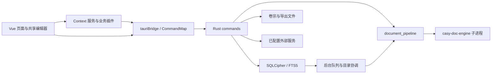

# 架构与模块

核对日期：2026-09-22。这是当前源码的实现导航，不将历史设计目标当作已交付功能。

## 数据通路

并非所有页面都经过 Context 服务；例如独立转换组件直接调用统一 `tauriCallSafe`。业务写入口最终位于 Rust。浏览器开发模式通过 mock 模拟部分命令，不能用浏览器成功提示证明桌面持久化或模型可用。

## 前端边界

| 入口 | 职责 |
| --- | --- |
| [router/index.js](../src/router/index.js) | 24 条路由；案件、任务、日历、文书、知识、文件、白板等 |
| [plugin/initializer.ts](../src/core/plugin/initializer.ts) | 初始化 10 个业务插件及已保存 AI 配置 |
| [tauriBridge.ts](../src/core/tauriBridge.ts) / [commandMap.ts](../src/types/commandMap.ts) | IPC 调用、超时和静态参数契约 |
| [tauriEvents.ts](../src/core/tauriEvents.ts) | 事件订阅及异步卸载处理 |
| [DocumentEditor.vue](../src/shared/editor/DocumentEditor.vue) | 文书、笔记共用编辑行为 |
| [mdBridge.ts](../src/shared/markdown/mdBridge.ts) | Markdown/富文本转换与 HTML 清理 |
| [RichCanvas.vue](../src/modules/whiteboard/components/RichCanvas.vue) | 白板场景与事实同步 |
| [tool-caller.ts](../src/core/ai/tool-caller.ts) | 模型工具轮次、参数检查、写操作提案 |

静态统计：121 个 Vue 文件，24 条路由，CommandMap 中 330 个 `Cmd` 声明（2026-09-22）。这些数值不证明每个入口已实现或通过验收。

## 后端与数据

- [lib.rs](../src-tauri/src/lib.rs)：Tauri 插件、应用初始化、命令注册、后台服务。
- [db/mod.rs](../src-tauri/src/db/mod.rs)：连接复用、加密密钥、维护模式；[schema.rs](../src-tauri/src/db/schema.rs) 当前版本 41，逐版本事务迁移。
- [commands/](../src-tauri/src/commands/)：IPC 入口与阻塞任务分派。
- [deadline/procedure.rs](../src-tauri/src/deadline/procedure.rs)：程序事件、版本校验、期限投影与关联案件；[规则说明](procedure-deadline-rules.md)。
- [background_jobs.rs](../src-tauri/src/background_jobs.rs)：文档/知识索引任务的持久化与执行；[processing.rs](../src-tauri/src/processing.rs) 记录活动与恢复状态。
- [workspace_sync.rs](../src-tauri/src/workspace_sync.rs)：目录登记、文件变更协调、OCR/知识联动。
- [document_pipeline.rs](../src-tauri/src/document_pipeline.rs)：引擎调度、进度、产物及来源校验。
- [knowledge_index.rs](../src-tauri/src/db/knowledge_index.rs)、[vector_index.rs](../src-tauri/src/db/vector_index.rs)：SQLite 分段/向量数据与 Zvec 索引。
- [portable_backup.rs](../src-tauri/src/commands/portable_backup.rs)：含附件的加密备份、路径迁移及恢复保护。

数据库是业务状态权威；原始附件、派生文档、图片、运行时模型和日志在文件系统。Markdown 备份、页 IR、来源映射和数据库记录必须关联同一源文件哈希，不能只检查文件存在。

## 长任务与状态

案件 OCR 有持久化文档任务和后台工作器。独立文件转换在前端先登记 processing activities，随后逐个发起长 IPC 调用；它不是可在应用重启后自动续跑的完整持久化转换队列。

0.1.3 转换及长导入/导出/备份等待后端结果，处理中心可取消转换；后端保留 15 分钟无页数或阶段变化的停滞保护。其他长任务完整结果查询与恢复契约仍需补齐，见 [审阅 R-06](CODE_REVIEW_2026-09-22.md)。

## 外部服务与交付

AI gateway/profile/proposal、飞书、CalDAV、WebDAV、IMAP/SMTP、MCP 都有代码入口，但配置、状态、实现成熟度不同。实现情况见 [数据与安全](DATA_AND_SECURITY.md)。

资源准备与应用构建分开；完整包须同时包含引擎、模型、渲染器、字体、Zvec 和对应声明。平台与校验流程见 [运行时分发](runtime-distribution-plan.md)。
