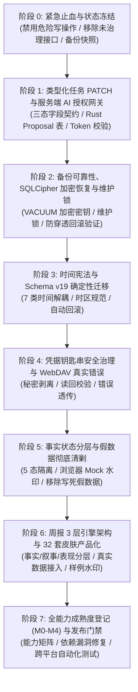

# Casy V5 系统整改与演进改进计划 (v5.1 架构审阅修订版)

> **版本**：v5.1 (架构审阅修订版)  
> **编制日期**：2026-08-29  
> **状态**：已根据架构评审意见全面修正，进入分阶段门禁实施基线  
> **依据文件**：
> 1. 《Casy 当前工作区全面代码审计》（`docs/audits/casy-v4-code-audit-2026-08-29.md`）
> 2. 《Casy 设计哲学 V5》（`docs/anti-gravity/casy-design-philosophy-v5.md`）
> 3. 《Casy V5 计划架构评审意见（2026-08-29）》  
> **核心原则**：**可信秩序，有边界的温度——严密闭环，凭据驱动，架构不可绕过**

---

## 1. 架构整改总原则与特性冻结 (Feature Freeze)

### 1.1 特性冻结规范 (Feature Freeze Directive)
- **冻结范围**：即日起至阶段 7 验收通过前，全系统**全面冻结**任何新增业务页面、新增路由、新 UI 概念或未在审计报告范围内的功能特性。
- **例外处理**：仅允许进行阻断性 Bug 修复、数据完整性加固、安全防御和合规审计相关代码改动。
- **解除条件**：阶段 0 至阶段 7 所有进入/退出门禁 100% 达成，且 CI 跨平台（macOS / Windows）全测试套件绿灯。

### 1.2 核心架构八项军规
1. **严禁为了消除 Clippy 告警而注册未治理的接口或扩大隐私暴露面**；
2. **严禁仅在前端做安全/授权拦截**，AI 授权必须为**Rust 服务端不可绕过网关**；
3. **严禁先迁移核心数据、后修备份恢复**，必须在确认备份恢复绝对可靠后方可执行 Schema 迁移；
4. **严禁弱类型/任意 JSON 局部更新**，任务 PATCH 必须为三态类型化契约并校验影响行数；
5. **严禁通用设置接口返回任何凭据原文**，钥匙串迁移必须采用“写入 -> 读回验证 -> 删除旧值”安全事务；
6. **严禁将 WebDAV/网络失败包装为 `Ok` 返回**，必须如实透传结构化错误；
7. **严禁空数据冒充“风险已清零”**，严格隔离加载中、空数据、离线降级与已核验状态；
8. **周报引擎严格分为三层**：`facts_snapshot`（事实快照）→ `narrative`（叙事评述）→ `presentation`（皮肤排版）。

---

## 2. 改进路线图与阶段演进依赖

---

## 3. 分阶段实施计划与门禁定义

### 阶段 0：紧急止血、接口收敛与状态冻结 (Emergency Bleeding Control)

> **目标**：立即阻止潜在数据损坏与隐私暴露风险，清理未治理接口，建立基线快照。

- **进入条件**：工作区代码与审计报告基线已归档。
- **具体整改项**：
  1. **移除并清理未治理的 AI 偏好接口 (P0-1)**：
     - 从 `src-tauri/src/commands/mod.rs` 中移除 `record_ai_preference` 与 `get_ai_preferences`。
     - 清理 `src-tauri/src/commands/ai_routes.rs` 中未治理的 `AiPreference` 逻辑与前端 `src/core/services/ai.ts` 中的调用桩。
     - **治理准则**：未来如需实现 AI 反馈自进化，必须重新设计专门的《AI 偏好治理规范》，遵循“局部观察 → 候选偏好 → 自动脱敏 → 用户显式确认 → 有限启用 → 可随时删除”的完整闭环，严禁明文持久化用户完整输入/输出。
  2. **消除异步路径嵌套 Runtime Panic (P1-1)**：
     - 盘点所有 `block_on` 调用：网络异步操作（WebDAV/CalDAV/飞书）改为原生 `async fn` 并在 Tauri 命令中直接 `.await`；SQLite 阻塞同步操作统一使用 `run_blocking`。
  3. **捕获当前数据库安全基线快照**：
     - 生成 `baseline-pre-v5-snapshot.db`，作为后续所有迁移与破坏性测试的回滚原点。
- **退出门禁 (Exit Gate)**：
  - `cargo clippy --all-targets -- -D warnings` 零告警通过。
  - `cargo fmt --all -- --check` 格式一致。
  - 确认无未经隐私治理的提示词/业务输入暴露接口。
- **回滚方案**：代码回滚至 baseline commit。

---

### 阶段 1：类型化任务 PATCH 与服务端 AI 授权网关 (Typed PATCH & Server Gateway)

> **目标**：彻底解决 P0-01 数据被置空缺陷；建立 Rust 服务端不可绕过的 AI 授权与 Proposal 网关 (P0-2)。

- **进入条件**：阶段 0 门禁全绿，基线快照就绪。
- **具体整改项**：
  1. **构建类型化任务更新契约 `UpdateTaskPatch` (P1-2)**：
     - Rust 侧定义三态结构体 `PatchField<T>`（`Unset` 保持原值，`Null` 显式置空，`Value(T)` 赋新值）。
     - 支持更新 `task_name`, `description`, `completed`, `blocked`, `blocked_reason`, `priority`, `start_bucket`, `due_date`, `due_time`, `case_id`, `estimated_minutes`, `actual_minutes`, `time_block`, `context`, `parent_task_id`, `recurrence_rule`, `is_focus` 等。
     - 增加数据合法性校验（枚举值有效性、日期格式 YYYY-MM-DD、正整数分钟范围）。
     - 校验 SQL 影响行数（`rows_affected == 1`），若 ID 不存在返回 `TaskNotFound` 错误。
     - 任务更新、`task_events` 记录（推迟记录 `deferred`，移动记录 `moved`）与 CalDAV 同步在同一事务中原子完成。
  2. **Rust 服务端 Proposal 持久化与令牌网关 (P0-2)**：
     - 建立 `ai_proposals` 表（`id`, `tool_name`, `target_entity_type`, `target_entity_id`, `pre_state_hash`, `payload_json`, `auth_token`, `expires_at`, `status`）。
     - 当 AI 生成写操作请求时，仅落库为 `pending` 状态的 Proposal 并返回预览 Diff。
     - 用户在 UI 确认后，向后端传递一次性 `auth_token`；Rust 服务端写命令严格校验：
       - `auth_token` 是否有效、未过期、未消费；
       - 操作目标实体与前置状态 Hash 是否与提案严格一致；
       - 验证通过后执行写操作并将 Proposal 标记为 `executed`（单次幂等）。
     - **默认拒绝**：任何带 `origin: 'ai'` 但未携带有效授权 Proposal 的直接写调用，Rust 内核一律返回 `PermissionDenied`。
- **退出门禁 (Exit Gate)**：
  - 编写并运行 `src-tauri/tests/task_patch_test.rs`：测试局部更新 `completed` 或 `priority`，断言其他 10 余个字段绝对未被置为 NULL；测试错误 ID 报错；测试显式置空生效。
  - 编写并运行 `src-tauri/tests/ai_gateway_test.rs`：直接通过 IPC 调用写接口，无 token 或 token 过期时 100% 被 Rust 拦截。
- **回滚方案**：若 PATCH 逻辑破坏现有功能，回滚至阶段 0 数据库快照与代码分支。

---

### 阶段 2：备份可靠性、SQLCipher 加密恢复与维护锁 (Reliable Backup & Recovery)

> **目标**：在进行大规模时间数据迁移前，先确立 100% 可靠的加密备份、防穿透验证与原子恢复能力 (P1-4)。

- **进入条件**：阶段 1 类型化 PATCH 与 AI 服务端网关测试通过。
- **具体整改项**：
  1. **修复 SQLCipher 备份与完整性检查**：
     - 修复使用 SQLCipher 时 `VACUUM INTO` 或直接复制未正确传递加密密钥（Key Pragma）导致的备份库损坏问题。
     - 执行备份前后运行 `PRAGMA cipher_integrity_check` 验证物理一致性。
  2. **数据库维护锁与优雅连接释放 (Maintenance Lock)**：
     - 恢复备份前，向系统广播 `MaintenanceMode`，暂停后台提醒调度器（`ReminderWorker`）、WebDAV 轮询与文件监听器。
     - 释放全局活跃 SQLite 连接池，执行恢复写入。
  3. **路径穿透防御与基于安全 ID 的恢复**：
     - 前端仅传递服务器生成的 `backup_id`，禁止透传任意文件路径。
     - 后端严格校验：解析后的绝对路径必须落在 `backups_dir` 规范化目录内，拒绝任何包含 `..`、`/`、`\`、`\0` 的非法请求。
  4. **恢复前强制快照与自动化回退**：
     - 恢复执行前自动创建 `pre-restore-<timestamp>.db` 快照。
     - 新数据库挂载后立即执行 Smoke Test（读取表数量、核心数据量），若失败立即原子回滚至 pre-restore 快照并向用户告警。
- **退出门禁 (Exit Gate)**：
  - 编写并运行 `src-tauri/tests/backup_restore_test.rs`：覆盖完整备份、路径穿透攻击注入拒绝、损坏文件恢复自愈与 pre-restore 回滚。
- **回滚方案**：利用阶段 0 快照恢复工作区数据库。

---

### 阶段 3：时间宪法与 Schema v19 确定性迁移 (Time Constitution & Migration)

> **目标**：彻底解耦 7 类时间维度，规范时区规则，安全平滑迁移历史数据 (P1-3)。

- **进入条件**：阶段 2 备份与恢复系统已证明 100% 可靠。
- **具体整改项**：
  1. **解耦 7 类时间模型**：
     - `available_at`（最早可着手日期/时刻）
     - `planned_start` / `planned_end`（专注投入工作时段，与日历视图直接绑定）
     - `deadline_at`（外部法定时限/绝限，带红线预警，未经显式修改保持不变）
     - `reminder_at`（主动通知提醒时刻）
     - `review_at`（复盘/随访日期）
     - `event_start` / `event_end`（日历专属日程事件时段）
     - `sys_time`（`created_at`, `updated_at`, `deleted_at` 系统审计时间）
  2. **时区与格式规范**：
     - 日期型（如开庭日、到期日）：统一采用 ISO-8601 `YYYY-MM-DD`（以当地法定日历为准）。
     - 时刻型（如提醒、系统事件）：统一采用带本地时区或 UTC 格式的 ISO-8601 标准字符串。
  3. **历史数据映射与 Schema v19 迁移**：
     - 建立明确的旧字段映射规则：
       - `deadline` / `due_date` → 明确映射为 `deadline_at`
       - `due_time` → 结合 `due_date` 格式化为合法时刻
       - `start_date` / `time_block` → 映射为 `planned_start` / `planned_end`
     - 约束校验：`start_bucket` 严格约束为 `inbox | anytime | someday | today`。
     - 迁移前后执行行数、字段值覆盖率比对；若校验不通过自动触发阶段 2 恢复机制。
  4. **日历交互重构**：
     - 重构 `CalendarView.vue`：拖拽任务到日程表仅修改 `planned_start` / `planned_end`，明确提示用户“已安排工作时间块”；禁止静默改写 `deadline_at`。
- **退出门禁 (Exit Gate)**：
  - 运行迁移测试，100% 历史任务数据成功转换，无 CHECK 约束违规。
  - 日历拖拽与任务看板时间同步测试通过。
- **回滚方案**：通过 pre-migration 快照执行一键无损回滚。

---

### 阶段 4：凭据钥匙串治理与 WebDAV 真实错误透传 (Credentials & Honest WebDAV)

> **目标**：消除普通设置中的明文密码，实现基于 OS Keychain 的安全存取与真实的同步状态反馈 (P1-4)。

- **进入条件**：阶段 3 时间迁移完成。
- **具体整改项**：
  1. **秘密剥离与钥匙串安全迁移事务**：
     - 将 `ai_api_key`, `webdav_password`, `smtp_pass`, `caldav_pass`, `feishu_secret` 迁移至系统钥匙串（`keyring`）。
     - **迁移事务**：写入 Keychain → 读回比对验证成功 → 从 settings 表中擦除原始密文字符串。
     - 通用 `get_settings` 接口永不返回密钥明文，仅返回元数据 `{ configured: true, source: 'keychain', last_verified_at: '...' }`。
     - 若系统 Keychain 不可用，明确弹出系统安全告警，**严禁静默回退为 SQLite 明文存储**。
  2. **WebDAV 真实错误透传与状态机对接**：
     - 重构 `src-tauri/src/commands/sync.rs`：测试连接与同步失败时必须返回 `Err(SyncError)`，禁止将错误信息包装在 `Ok(...)` 中返回。
     - 前端 `WebDAVSettings.vue` 与 `SyncStatusView.vue` 根据后端真实错误码渲染红/绿/黄状态指示灯与重试按钮。
- **退出门禁 (Exit Gate)**：
  - 通用设置接口导出与查看，确认 0 秘密明文泄漏。
  - 模拟 WebDAV 错误密码与断网场景，前端正确提示失败并显示错误细节。
- **回滚方案**：恢复上阶段设置数据。

---

### 阶段 5：事实状态分层与假数据彻底清剿 (Fact Integrity & Mock Sandbox)

> **目标**：杜绝生产环境残留假数据，严格区分 5 类系统状态，消除无依据的“全部清零”虚假安全感 (P0-03)。

- **进入条件**：阶段 4 凭据与同步整改完成。
- **具体整改项**：
  1. **生产代码硬编码假数据彻底清剿**：
     - 彻底检索并移除所有生产视图组件中未受治理的 `'Chen vs. TechCorp'`, `'CIV-23-089'`, `'隆基案证据'` 等占位文本。
  2. **严格建立 5 态界面反馈标准**：
     - `State 1: Loading`（明确的骨架屏或加载动画）
     - `State 2: Empty`（成功加载且明确为 0 条数据，文案为“当前暂无待办事项”）
     - `State 3: Degraded / Offline`（离线或外部源不可用，注明上次同步核验时间）
     - `State 4: Error / Retry`（加载失败，提供显式重试按钮与错误说明）
     - `State 5: Verified Clean`（经数据源联合核验确认无到期风险，必须标注核验时间与来源范围）
  3. **浏览器开发模式常驻水印**：
     - 非 Tauri 桌面容器环境下，顶部常驻展示 `[Mock 预览模式]` 胶囊提示，明确告知当前运行依赖模拟数据。
- **退出门禁 (Exit Gate)**：
  - 空数据库初始化后启动，无任何虚构案名与硬编码脏数据。
  - 各核心看板在网络中断/空数据/正常数据下呈现清晰准确的对应状态。
- **回滚方案**：代码回滚至对应 PR 分支。

---

### 阶段 6：周报 3 层引擎架构与 32 套皮肤产品化 (Weekly Report 3-Tier Architecture)

> **目标**：落实事实/叙事/表现三层解耦架构，规范 16 套日报 + 16 套周报（共 32 套）皮肤资产 (P1-5)。

- **进入条件**：阶段 5 事实层与数据源整改完成。
- **具体整改项**：
  1. **周报三层架构解耦**：
     - **第 1 层：`facts_snapshot`（事实快照）**：由后端 `reports` 聚合引擎从真实 SQLite 数据库中提取（本周完成任务数、各案件推进时长、法庭排期、下周红线），记录数据覆盖区间与生成时间戳。
     - **第 2 层：`narrative`（叙事评述）**：由规则引擎或 AI 模型基于 `facts_snapshot` 生成的工作小结、风险提示与专业评述。
     - **第 3 层：`presentation`（表现排版）**：包含 32 套皮肤样式（16 套日报 + 16 套周报）、排版色彩、字体与导出布局。
  2. **切换与重生成行为规范**：
     - 切换皮肤：仅改变第 3 层排版，事实快照与叙事 100% 保持不变；
     - 重新生成总结：仅基于原事实快照重新生成第 2 层叙事；
     - 刷新报告数据：重新查询数据库生成新的 `facts_snapshot` 版本。
  3. **后端真实周报命令对接**：
     - 对接已有的 `get_latest_weekly_summary` 与 `generate_weekly_summary_cmd`，消除前端 mock 假周报逻辑。
  4. **样例预览模式水印与无障碍导出**：
     - 预览模式或设置中心展示模板效果时，强制覆盖半透明“样例数据 · 不代表真实案卷”水印。
     - 支持系统级 `prefers-reduced-motion` 动效减弱与高对比度黑白打印/导出。
- **退出门禁 (Exit Gate)**：
  - 事实层与底层真实任务/案件统计数据 1:1 吻合。
  - 切换皮肤 0 耗时即时渲染，重生成叙事不改变事实数字。
- **回滚方案**：回滚周报组件代码变更。

---

### 阶段 7：全能力成熟度登记 (M0-M4) 与跨平台发布验收 (Maturity & Release Gate)

> **目标**：建立能力级成熟度档案，修复已知依赖漏洞，完成全自动化 CI 门禁与跨平台构建发布 (P1-6)。

- **进入条件**：阶段 0 至阶段 6 实施全数通过。
- **具体整改项**：
  1. **基于“能力 (Capabilities)”的 M0-M4 成熟度矩阵**：
     - 编制 `docs/compliance/capability-maturity-matrix.md`，按核心能力维度（如：任务局部更新、时间双轨模型、AI 授权提案网关、凭据安全、加密备份恢复、周报事实引擎等）登记成熟度等级（M0 规划中 → M1 原型 → M2 联调中 → M3 自动化验证 → M4 生产就绪）。
     - 仅 M3 及以上能力可在 UI 中向用户开放生产入口。
  2. **前端第三方依赖安全治理**：
     - 处理 `html-to-docx -> image-size` 等依赖安全告警，锁定安全子版本或引入安全沙盒隔离。
  3. **全面跨平台自动化测试与发布流水线**：
     - 执行前端测试：`npm run typecheck` + `npm run test:unit` + `npm run build`。
     - 执行后端测试：`cargo fmt --all -- --check` + `cargo clippy --all-targets -- -D warnings` + `cargo test`。
     - 运行安全审计：`cargo audit` 与 `npm audit --omit=dev`。
     - macOS 与 Windows 真实打包安装、冷启动、数据迁移与功能冒烟测试（Smoke Test）。
- **退出门禁 (Exit Gate)**：
  - 全套测试流水线 100% 绿灯通过，无未决 P0/P1 问题，签署发布验收单。

---

## 4. 核心验收检查单 (Definition of Done)

| 验证项 | 验证方式与客观标准 | 状态 |
|---|---|:---:|
| **P0-1 隐私接口治理** | 确认未治理的 `record_ai_preference` / `get_ai_preferences` 已从 Tauri 注册表彻底移除，无任何明文提示词/业务输入暴露接口。 | **已修正** |
| **P0-2 服务端 AI 网关** | 直接通过 Tauri IPC 发送写操作命令（无 token / 伪造 token），后端必须硬性拦截并返回 `PermissionDenied`。 | 待验收 |
| **P0-3 阶段顺序与快照** | 实施严格按照“止血/快照 → PATCH/网关 → 备份恢复 → 时间迁移 → 凭据 → 事实 → 周报 → 发布”顺序执行，每阶段具备回滚点。 | **已确立** |
| **P1-1 Runtime 纯净化** | 全局搜索并确认无在异步 Tokio 工作线程内调用 `Runtime::new().block_on` 的逻辑，网络 IO 全部异步化。 | **已修正** |
| **P1-2 类型化任务 PATCH** | 运行 `tests/task_patch_test.rs`：局部更新 `completed`，重启后 `due_date`, `case_id`, `context` 等所有其他字段保持 100% 完整；错误 ID 报错。 | 待验收 |
| **P1-3 时间模型解耦** | 7 类时间维度完全分离；日历拖拽仅改变 `planned_start/end`，不改动 `deadline_at`；Schema v19 平滑迁移无丢失。 | 待验收 |
| **P1-4 凭据与加密恢复** | `get_settings` 返回 0 秘密原文；备份与恢复严格应用 SQLCipher 密钥；恢复执行维护锁与路径防穿透校验。 | 待验收 |
| **P1-5 周报三层分层** | 事实快照（确定性真实数字）、叙事层（AI评述）、表现层（32套皮肤）严格解耦，切换皮肤 0 秒渲染，事实不变。 | 待验收 |
| **P1-6 工程与发布门禁** | `cargo test`, `cargo clippy -D warnings`, `cargo fmt --check`, `npm run typecheck`, `npm run build` 全数 100% 通过。 | 待验收 |

---

## 5. 总结

本修订版计划（v5.1）完全纠正了初稿中存在的“为了消除警告而暴露隐私接口”、“授权网关停留在前端代码”、“时间迁移先于恢复能力建设”等结构性缺陷。通过建立**类型化契约、Rust 服务端强制授权网关、SQLCipher 恢复维护锁与周报三层解耦模型**，使整改路线具备了严密的工程逻辑、明确的阶段门禁和绝对可信的数据安全保障。
