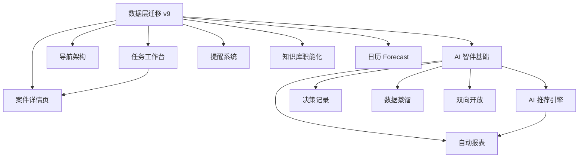

# Casy 系统完整实现与模块重构规划

> **版本**: v1.0  
> **日期**: 2026-08-18  
> **状态**: 实施中  
> **指导文档**: `docs/casy-design-philosophy.md` / `docs/architecture.md` / `docs/modules/`

---

## 一、核心设计原则提炼

### 1.1 八大设计原则（设计哲学）

| 原则 | 核心要义 | 实现约束 |
|------|---------|---------|
| **案件即流程** | 案件 = 顺序项目，只有 blocked=0 的行动可见 | 案件 `sequential=1`，任务完成自动解锁下一步 |
| **时间双轨** | `start_date`（When）+ `due_date`（Deadline）分离 | 任务双轨字段，硬性日程进日历，弹性行动进任务清单 |
| **先捕获后整理** | 极简输入 → 收件箱 → 厘清 | Cmd+T/E/N/I 全局快捷键，输入框不标题 |
| **数据有限视图无限** | 4 元信息（案件/任务/领域/知识）+ 透视 | 同一数据多视图（列表/看板/日历） |
| **克制即优雅** | 信息密度优先，拒绝装饰 | 线性图标，无 emoji，语义色 |
| **主动智伴** | AI 越用越懂你，双路径（Rule/AI） | 确定性走规则，智能走 AI，四道保障 |
| **数据蒸馏** | 三层记忆（L1 原始/L2 提炼/L3 知识） | 蒸馏循环：积累→提炼→确认→清理 |
| **双向开放** | MCP Server（对外）+ Skill Runner（对内） | 组件化智伴层，trait + enum 切换 |

### 1.2 关键架构约束

1. **双路径铁律**：每个功能明确属于"去 AI 路径"或"含 AI 路径"
2. **effective_policy**：`max(system_minimum, scenario, model, user)`
3. **模型可见即记录**：`ai_runs` + `ai_context_items` 可重建 AI 上下文
4. **source_ref 正式 schema**：JSON 单源 + provenance 多源
5. **离线提醒四层语义**：计算正确 → 进入队列 → 服务端接受 → 用户已读

---

## 二、核心功能模块清单

### 2.1 模块划分与职责

| 编号 | 模块 | 职责 | 依赖模块 | 优先级 |
|------|------|------|---------|--------|
| M1 | 数据层迁移 v9 | GTD 字段 + 新表 + 状态机 | 无 | P0 |
| M2 | 任务工作台 | 5 透视 + 厘清 + 下一步行动 | M1, M3 | P0 |
| M3 | 导航架构 | 三层导航 + 今日面板 + 浮动捕获 | M1 | P0 |
| M4 | 案件详情页 | 项目书结构 + 三轨状态 + 进度环 | M1, M2 | P0 |
| M5 | AI 智伴基础 | 双路径路由 + Confirmer + ai_runs | M1 | P1 |
| M6 | 提醒系统 | 分级预警 R1-R4 + 启动拉起 | M1 | P1 |
| M7 | 知识库职能化 | 6 职能分类 + 标签动态化 | M1 | P2 |
| M8 | 日历 Forecast | 双栏布局 + 颜色编码 + 拖拽 | M1, M2 | P2 |
| M9 | AI 推荐引擎 | 今日任务/优先级/时间预估 | M5 | P3 |
| M10 | 决策记录 | decisions 表 + 决策链 + 复核 | M5 | P3 |
| M11 | 自动报表 | 日/周/月/项目，对内对外双轨 | M5, M9 | P3 |
| M12 | 数据蒸馏 | L2 蒸馏 + 确认区 + 生命周期 | M5 | P4 |
| M13 | 双向开放 | MCP Server + Skill Runner | M5 | P4 |

### 2.2 模块依赖关系图



---

## 三、技术栈选择

### 3.1 现有技术栈（保持不变）

| 技术 | 版本 | 用途 |
|------|------|------|
| Tauri | 2.x | 桌面框架 |
| Vue | 3.x | 前端框架 |
| Pinia | 2.x | 状态管理 |
| Element Plus | 2.x | UI 组件库 |
| SQLite (SQLCipher) | 3.x | 数据库 |
| Rust | 1.x | 后端逻辑 |
| TipTap | 3.x | 富文本编辑器 |

### 3.2 新增依赖（按需引入）

| 依赖 | 用途 | 引入时机 |
|------|------|---------|
| `icalendar` | ICS 日程生成（日历同步） | M6 |
| `caldav-client` | CalDAV 客户端（日历同步） | M6 |
| `serde_json` | JSON 处理（source_ref） | M1 |
| `chrono` | 日期时间处理（已有） | - |
| `tokio` | 异步运行时（已有） | - |

### 3.3 选择理由

1. **保持现有栈**：项目已有成熟实现，重构而非重写
2. **渐进式引入**：新依赖按需引入，避免一次性大改
3. **本地优先**：所有数据处理本地完成，AI 可选

---

## 四、目录结构与代码组织规范

### 4.1 Rust 后端目录结构

```
src-tauri/src/
├── commands/           # Tauri 命令层（薄壳，调度业务模块）
│   ├── mod.rs         # 命令注册
│   ├── cases.rs       # 案件命令
│   ├── tasks.rs       # 任务命令
│   ├── ai.rs          # AI 命令（新增）
│   ├── reminder.rs    # 提醒命令（已有）
│   └── ...
├── db/                # 数据访问层
│   ├── schema.rs      # 数据库 Schema（v9 迁移）
│   ├── mod.rs         # 数据库连接管理
│   ├── cases.rs       # 案件数据访问
│   ├── tasks.rs       # 任务数据访问
│   └── ...
├── domain/            # 领域层（新增，逐步收口写路径）
│   ├── mod.rs         # 领域服务入口
│   ├── case_service.rs # 案件领域服务
│   ├── task_service.rs # 任务领域服务
│   └── ...
├── ai/                # AI 智伴模块
│   ├── mod.rs         # AI 后端抽象
│   ├── provider.rs    # ModelProvider trait
│   ├── context.rs     # ContextBuilder
│   ├── recommender.rs # 推荐器
│   ├── confirmer.rs   # 确认策略
│   └── ...
├── deadline/          # 期限引擎（已有）
├── formula/           # 公式引擎（已有）
├── sync/              # 同步引擎（已有）
├── files/             # 文件管理（已有）
├── email/             # 邮件监听（已有）
├── parse/             # 文档解析（已有）
├── docsy_engine/      # 文书工坊（已有）
├── lib.rs             # 应用入口
├── main.rs            # 主函数
├── tray.rs            # 系统托盘（已有）
└── watcher.rs         # 文件夹监听（已有）
```

### 4.2 Vue 前端目录结构

```
src/
├── assets/            # 静态资源
│   ├── theme.css      # 主题样式（已有）
│   └── icons/         # 线性图标（新增）
├── components/        # 全局组件
│   ├── TodayPanel.vue # 今日面板（新增）
│   ├── QuickCapture.vue # 浮动捕获按钮（新增）
│   └── ...
├── modules/           # 业务模块（按功能划分）
│   ├── cases/         # 案件模块
│   ├── tasks/         # 任务模块（重构）
│   ├── calendar/      # 日历模块（重构）
│   ├── inbox/         # 收件箱模块
│   ├── knowledge/     # 知识库模块（重构）
│   ├── ai/            # AI 智伴模块（新增）
│   └── ...
├── stores/            # Pinia 状态管理
│   ├── cases.js       # 案件状态
│   ├── tasks.js       # 任务状态（重构）
│   ├── ai.js          # AI 状态（新增）
│   └── ...
├── router/            # 路由配置
│   └── index.js       # 路由定义（重构）
├── App.vue            # 应用根组件（重构导航）
├── main.js            # 应用入口
└── style.css          # 全局样式
```

### 4.3 代码组织规范

1. **单一职责**：每个文件只做一件事
2. **依赖注入**：通过参数传递依赖，避免全局状态
3. **错误处理**：统一使用 `CasyError`，前端 `tauriCallSafe`
4. **命名规范**：
   - Rust：`snake_case`，类型 `PascalCase`
   - Vue：`PascalCase` 组件，`camelCase` 函数
   - 数据库：`snake_case` 表名和字段
5. **注释规范**：公共 API 必须文档注释，复杂逻辑必须行内注释

---

## 五、实施路线图

### Phase 1: 数据地基（M1，1-2 周）

**目标**：完成数据层迁移 v9，为后续模块提供数据基础

**任务清单**：
1. 设计 v9 迁移 SQL（GTD 字段 + 新表）
2. 实现 `tasks` 表 GTD 字段迁移
3. 实现 `cases` 表项目化字段迁移
4. 创建 `task_events` 表（行为学习）
5. 创建 `decisions` 表（决策记录）
6. 创建 `ai_runs` + `ai_context_items` 表（AI 审计）
7. 创建 `audit_events` 表（领域事件）
8. 创建 `daily_stats` + `smart_summaries` 表（报表）
9. 更新 `schema.rs` 版本号
10. 编写迁移测试

**验收标准**：
- 迁移脚本可重复执行，不破坏现有数据
- 新表结构符合设计文档定义
- 现有功能不受影响

### Phase 2: 核心体验（M2-M4，2-3 周）

**目标**：完成任务工作台、导航架构、案件详情页重构

**任务清单**：
1. 实现任务 5 透视数据查询
2. 实现任务厘清流程
3. 实现顺序项目 blocked 机制
4. 重构导航为三层架构
5. 实现今日面板（规则聚合）
6. 实现浮动捕获按钮
7. 重构案件详情页为项目书结构
8. 实现进度环和下一步行动卡

**验收标准**：
- 任务工作台可切换 5 个透视
- 今日面板正确显示硬性日程 + 到期任务
- 案件详情页显示项目书结构

### Phase 3: AI 基础（M5-M6，2-3 周）

**目标**：完成 AI 智伴基础和提醒系统

**任务清单**：
1. 实现双路径路由表
2. 实现最小 Confirmer（effective_policy）
3. 实现 ai_runs 审计日志
4. 实现 fallback contract（降级态）
5. 接通提醒引擎启动拉起
6. 实现分级预警 R1-R4
7. 实现补偿扫描（区间触发）

**验收标准**：
- AI 调用自动记录到 ai_runs
- 提醒引擎启动时自动拉起
- R1-R4 分级预警正确触发

### Phase 4: 深度功能（M7-M8，2 周）

**目标**：完成知识库职能化和日历 Forecast

**任务清单**：
1. 知识库改为 6 职能分类
2. 实现标签动态化
3. 重写日历为 Forecast 双栏
4. 实现颜色编码和拖拽改期

**验收标准**：
- 知识库可按 6 职能筛选
- 日历显示双栏布局

### Phase 5: 进阶功能（M9-M11，3-4 周）

**目标**：完成 AI 推荐引擎、决策记录、自动报表

**任务清单**：
1. 实现推荐引擎（今日任务/优先级/时间预估）
2. 实现决策记录和复核
3. 实现自动报表（日/周/月/项目）
4. 实现对外报表叙事生成

**验收标准**：
- 推荐引擎可生成今日任务推荐
- 决策记录可追溯
- 报表可自动生成

### Phase 6: 长期功能（M12-M13，4+ 周）

**目标**：完成数据蒸馏和双向开放

**任务清单**：
1. 实现 L2 蒸馏和确认区
2. 实现记忆生命周期
3. 实现 MCP Server 对外接口
4. 实现 Skill Runner 对内接口

**验收标准**：
- 蒸馏循环可运行
- MCP 接口可查询案件/任务

---

## 六、开发决策记录

### 6.1 关键决策

| 决策 | 选择 | 理由 |
|------|------|------|
| 重构策略 | 渐进式重构，而非重写 | 保护已有投资，降低风险 |
| 数据迁移 | 增量迁移，向后兼容 | 用户数据不丢失 |
| AI 集成 | 可选，有规则版降级 | 不依赖 AI 也能完整运行 |
| 日历同步 | CalDAV + ICS via Email | 零自建基础设施，可靠性高 |
| 状态管理 | 保持 Pinia，逐步收口 | 避免大改前端架构 |

### 6.2 风险与缓解

| 风险 | 影响 | 缓解措施 |
|------|------|---------|
| 数据迁移失败 | 用户数据丢失 | 自动备份 .bak，回滚脚本 |
| 性能下降 | 用户体验差 | 分页加载，缓存字段 |
| AI 依赖 | 功能不可用 | 规则版降级，明示状态 |
| 日历同步失败 | 提醒不准时 | M0 本地尽力而为，明示边界 |

---

## 七、验收标准总览

### 7.1 M0 验收标准（最小可用版本）

1. 律师能创建案件 → 填三轨状态 → 生成顺序任务 → 完成任务解锁下一步
2. 今日面板准确显示：硬性日程 + 到期任务 + 等待超时 + 需回顾案件
3. 期限引擎照常工作
4. 全程不依赖 AI
5. 提醒 M0 为本地尽力而为

### 7.2 完整系统验收标准

1. 所有模块可独立运行、可测试
2. 数据层迁移 v9 完成
3. 任务工作台 5 透视可用
4. 导航三层架构可用
5. AI 智伴基础可用
6. 提醒系统 R1-R4 可用
7. 代码符合设计原则和架构约束
8. 开发过程记录完整

---

## 八、后续迭代建议

1. **移动端伴侣**：仅当移动办公需求成立时立项
2. **动态字段系统**：长期方向，从固定列演进为字段定义
3. **知识图谱可视化**：知识 ↔ 案件 ↔ 任务关系网络
4. **跨模型成长系统**：多模型切换 + 模型留档
5. **蒸馏生命周期自动化**：陈旧归档 / 重复合并 / 自动清理

---

**下一步**：开始 Phase 1 数据层迁移 v9 实现。